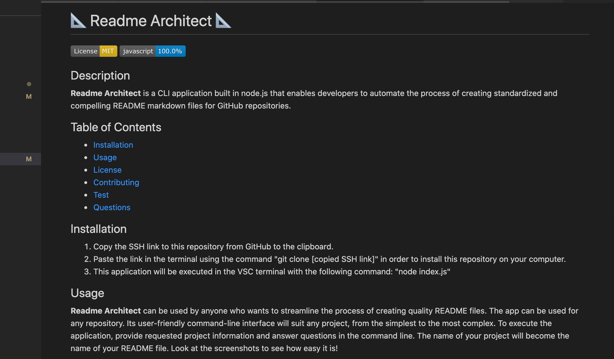

# :triangular_ruler: Readme Architect :triangular_ruler:

## Description
__Readme Architect__ is a CLI application built in node.js that enables developers to automate the process of creating standardized and compelling README markdown files for GitHub repositories.

## Table of Contents
* [Installation](#Installation)
* [Usage](#Usage)
* [License](#License)
* [Contributing](#Contributing)
* [Test](#Test)
* [Questions](#Questions)

## Installation
1. Copy the SSH link to this repository from GitHub to the clipboard.
2. Paste the link in the terminal using the command "git clone [copied SSH link]" in order to install this repository on your computer.
3. This application will be initiated in the VSC terminal with the following command: "node index.js"

## Usage
__Readme Architect__ can be used by anyone who wants to streamline the process of creating quality README files.
The app can be used for any repository.
Its user-friendly command-line interface will suit any project, from the simplest to the most complex. 
1. After initiating the application in the VSC terminal, provide requested project information and answer all of the questions that appear in the command line.
2. The title of your project will become the title displayed on the top of your README file.
3. All the answers will be displayed in the appropriate sections of the README file.
4. Table of Contents containing clickable links to the sections reflecting the aswers (Installation, Usage, License, Contributing, Test, Questions) will be created.
5. The license badge will be presented near the top of the page.
6. The "Questions" section on the bottom of the README will show a link to user's GitHub repository and user's email address.
7. Follow the screenshots below to see how easy it is!

  

## License
This application is covered under the MIT license.

## Contributing
If you want to contribute to this repo, please follow the good practices of Contributor Covenant. 
Many thanks to Joao Campos for helping me navigate through node.js.

## Test
Coming soon!

## Questions
If you have any questions, reach me via GitHub: [piotr72us](https://github.com/Piotr72us) 
or send me an email at: piotr72@gmail.com
